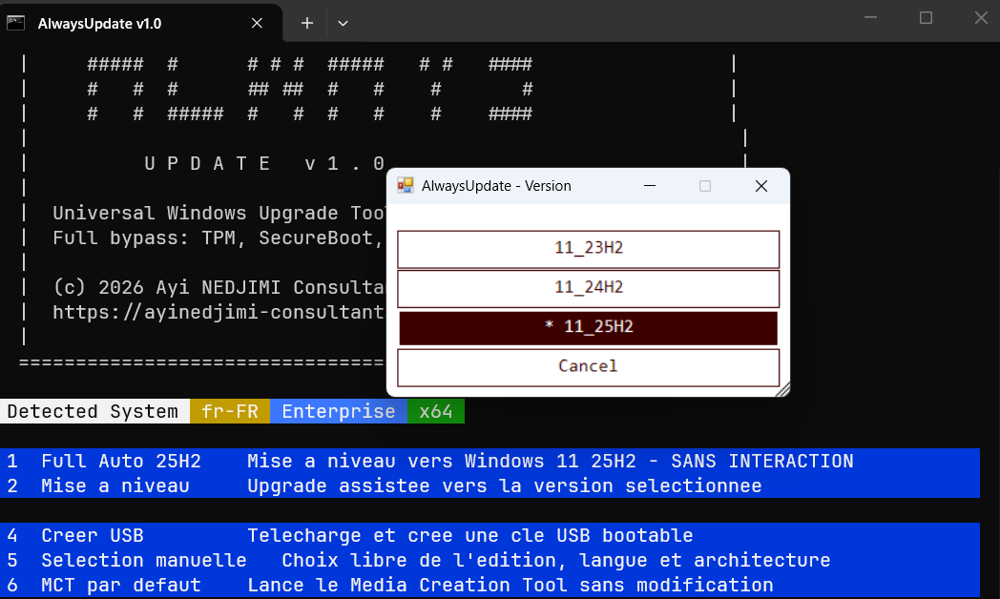

[](https://www.microsoft.com/windows)
[](https://learn.microsoft.com/powershell/)
[](LICENSE)


# AlwaysUpdate v1.1

**Universal Windows Upgrade Tool with Full Hardware Bypass**

Upgrades ANY Windows 10/11 PC to the latest Windows 11 -- even without TPM 2.0, Secure Boot, or a supported CPU. Uses only Microsoft-hosted sources. No third-party tools.

<p align="center">

<br><em>AlwaysUpdate v1.1 -- Version selection dialog / Dialogue de selection de version</em>
</p>

---

# Table of Contents / Sommaire

| English | Francais |
|---------|----------|
| [Overview](#overview) | [Presentation](#presentation) |
| [How It Works](#how-it-works) | [Fonctionnement](#fonctionnement) |
| [Features](#features) | [Fonctionnalites](#fonctionnalites) |
| [Requirements](#requirements) | [Prerequis](#prerequis) |
| [Usage](#usage) | [Utilisation](#utilisation) |
| [Presets](#presets) | [Modes](#modes) |
| [Bypass Details](#bypass-details) | [Details du Bypass](#details-du-bypass) |
| [Architecture](#architecture) | [Architecture](#architecture-1) |
| [Troubleshooting](#troubleshooting) | [Depannage](#depannage) |
| [FAQ](#faq) | [FAQ](#faq-1) |
| [Credits](#credits) | [Credits](#credits-1) |

---

# ENGLISH

---

## Overview

AlwaysUpdate is a single `.bat` script that upgrades any Windows 10 or Windows 11 machine to the **latest Windows 11** (currently 24H2/25H2), bypassing all Microsoft hardware requirements. It is based on the architecture of [MediaCreationTool.bat by AveYo](https://github.com/AveYo/MediaCreationTool.bat) with significant enhancements.

| Feature | Detail |
|---------|--------|
| **Target** | Windows 11 23H2 / 24H2 / 25H2 (latest by default) |
| **Source** | Microsoft CDN only (no third-party binaries) |
| **Bypass** | TPM 2.0, Secure Boot, CPU, RAM, Storage |
| **Modes** | Full Auto, Assisted Upgrade, ISO, USB, Manual |
| **Languages** | Auto-detected (French / English UI) |
| **Logging** | Full log at `C:\ESD\AlwaysUpdate.log` |
| **Size** | Single file, ~97 KB |

---

## How It Works

The script leverages a key discovery: the **Windows 11 23H2 Media Creation Tool** is the last MCT version that does **not** have a built-in TPM check. Newer MCT versions (24H2/25H2) block unsupported hardware before even starting.

AlwaysUpdate solves this by:

1. **Downloading the 23H2 MCT EXE** (no built-in TPM check)
2. **Capturing the latest product catalog** by running the fwlink MCT briefly -- the MCT downloads the catalog from Microsoft before performing any hardware check, we capture it and kill the MCT (~2-4 seconds)
3. **Modifying `products.xml`** to unhide Enterprise editions and adjust compatibility
4. **Running the 23H2 MCT** with the captured catalog -- gets the latest Windows 11 media
5. **Applying multi-layer hardware bypass** (registry keys, `appraiserres.dll`, `winsetup.dll` patch, `/Product Server` trick)

For 23H2 direct installs, the standard approach is used (known MCT EXE + known products CAB URL).

---

## Features

| Category | Details |
|----------|---------|
| **Hardware Bypass** | TPM 2.0, Secure Boot, Unsupported CPU, RAM < 4GB, Storage < 64GB |
| **Registry Bypass** | `LabConfig` keys (BypassTPMCheck, BypassSecureBootCheck, BypassCPUCheck, BypassRAMCheck, BypassStorageCheck) |
| **Setup Bypass** | Zero-byte `appraiserres.dll`, `winsetup.dll` function rename, `/Product Server` launch trick |
| **Policy Bypass** | `AllowUpgradesWithUnsupportedTPMorCPU`, `DisableWUfBSafeguards`, removes TargetReleaseVersion blocks |
| **Pre-flight Checks** | Admin rights, disk space (system + TEMP), internet, PowerShell version, conflicting processes, pending reboots, battery |
| **System Preparation** | Stops WU/BITS conflicts, disables WaaSMedicSvc, bypasses WSUS, enables TLS 1.2, cleans Appraiser data, clears reboot flags |
| **Progress Tracking** | Real-time progress bar (0-100%) with status messages in console |
| **Logging** | Timestamped log at `C:\ESD\AlwaysUpdate.log` |
| **Bilingual UI** | Auto-detects OS language -- French or English interface |
| **Catalog Capture** | Runs fwlink MCT briefly to obtain the latest products catalog from Microsoft -- always up-to-date, no hardcoded URLs needed |
| **Download Verification** | Rejects 0-byte or incomplete downloads, retries with multiple methods |
| **Eval Edition Warning** | Detects Evaluation editions and warns about potential licensing issues |
| **Fallback** | If catalog capture fails, automatically falls back to 23H2 catalog |
| **ISO / USB / Auto** | Create ISO, write USB, or direct in-place upgrade -- all with bypass |
| **Enterprise Support** | Unhides Enterprise/Education editions in MCT, cross-edition upgrade with EditionID workaround |
| **Boot Media Patch** | Patches `boot.wim` to disable hardware checks for clean installs from USB/ISO |
| **AutoUnattend** | Generates `AutoUnattend.xml` with dynamic version targeting for offline local account on Home editions |

---

## Requirements

| Requirement | Minimum |
|-------------|---------|
| **OS** | Windows 10 (any version) or Windows 11 (any version) |
| **Disk Space** | 12 GB free on system drive |
| **TEMP Space** | 8 GB free on TEMP drive |
| **Internet** | Required (downloads from Microsoft CDN) |
| **PowerShell** | v3.0+ (v5.1 recommended) |
| **Privileges** | Administrator (script self-elevates) |

---

## Usage

### Quick Start -- Full Auto

1. Download `AlwaysUpdate.bat`
2. Right-click > **Run as Administrator**
3. Select **Full Auto Upgrade** (preset 1)
4. Wait -- the script handles everything automatically

### Command Line

```batch
:: Direct auto upgrade to latest version (no prompts)
AlwaysUpdate.bat auto

:: Full auto mode (same as preset 1)
AlwaysUpdate.bat fullauto

:: Create ISO for 23H2
AlwaysUpdate.bat iso 11_23H2

:: Force Enterprise edition
AlwaysUpdate.bat auto Enterprise

:: Create default unmodified MCT media
AlwaysUpdate.bat def
```

### Script Rename

Rename the script file to auto-configure:

| Filename | Effect |
|----------|--------|
| `auto AlwaysUpdate.bat` | Auto upgrade to default version |
| `fullauto AlwaysUpdate.bat` | Full auto upgrade, no prompts |
| `iso AlwaysUpdate.bat` | Create ISO |
| `Enterprise auto AlwaysUpdate.bat` | Auto upgrade to Enterprise |
| `def AlwaysUpdate.bat` | Default MCT media (no bypass) |
| `fr-FR AlwaysUpdate.bat` | Force French language media |

---

## Presets

| # | Preset | Description |
|---|--------|-------------|
| 1 | **Full Auto Upgrade** | Upgrade to latest Windows 11 with zero interaction |
| 2 | **Auto Upgrade** | Assisted upgrade to selected version |
| 3 | **Create ISO** | Download and create ISO file in `C:\ESD` |
| 4 | **Create USB** | Download and create bootable USB drive |
| 5 | **Manual Select** | Choose edition, language and architecture in MCT GUI |
| 6 | **MCT Default** | Run Media Creation Tool without modifications |

---

## Bypass Details

### Layer 1 -- Registry Keys (before MCT launch)

```
HKLM\SYSTEM\Setup\LabConfig
  BypassTPMCheck = 1
  BypassSecureBootCheck = 1
  BypassCPUCheck = 1
  BypassRAMCheck = 1
  BypassStorageCheck = 1

HKLM\SYSTEM\Setup\MoSetup
  AllowUpgradesWithUnsupportedTPMorCPU = 1

HKLM\SOFTWARE\Policies\Microsoft\Windows\WindowsUpdate
  DisableWUfBSafeguards = 1
```

### Layer 2 -- Setup Media Patches (after media creation)

| Patch | Method | Effect |
|-------|--------|--------|
| `appraiserres.dll` | Replaced with 0-byte file | Disables hardware compatibility check in Windows Setup |
| `winsetup.dll` | Binary rename `Module_Init_HWRequirements` to `Module_Init_GatherDiskInfo` | Disables hardware checks in WinPE boot |
| `/Product Server` | Launch option prepended to setupprep.exe | Bypasses all client hardware checks |

### Layer 3 -- Edition Workaround (auto.cmd)

| Scenario | Method |
|----------|--------|
| Cross-edition upgrade | Temporary EditionID registry rename |
| Enterprise Eval to Enterprise | CompositionEditionID workaround |
| LTSC / IoT / Embedded | Edition mapping to Enterprise |

---

## Architecture

```
AlwaysUpdate.bat
    |
    |-- :init            Console setup, color palette, copy to C:\ESD
    |-- :config           User configuration (editions, language, keys)
    |-- :begin            OS detection, argument parsing, menu display
    |-- :preflight        Pre-flight checks (disk, network, PS, processes)
    |-- :prepare_system   System fixes (BITS, WU, WSUS, TLS, Appraiser)
    |
    |-- :process          Main workflow
    |   |-- Registry bypass keys
    |   |-- Download MCT EXE (23H2)
    |   |-- Capture catalog from fwlink MCT (24H2/25H2)
    |   |   `-- :capture_products_catalog (run MCT briefly, copy catalog)
    |   |-- Download products.cab (23H2 fallback)
    |   |-- :PRODUCTS_XML      Modify catalog (editions, labels)
    |   |-- Generate PID.txt, EI.cfg, auto.cmd, AutoUnattend.xml
    |   `-- :Assisted_MCT      PowerShell MCT automation
    |       |-- UI Automation (button clicks, path entry)
    |       |-- Progress bar (ESD download, media creation)
    |       |-- Add bypass files to media
    |       |-- appraiserres.dll patch
    |       |-- boot.wim winsetup.dll patch
    |       `-- auto.cmd launch (for upgrade preset)
    |
    |-- :DOWNLOAD         Multi-method download (BITS, WebClient, certutil)
    |-- :PRODUCTS_XML     Product catalog XML processor
    |-- :MakeISO          ISO creation via IMAPI2FS COM
    |-- :generate_auto_cmd       Upgrade script with edition matrix
    |-- :generate_AutoUnattend   Offline local account for Home
    `-- :capture_products_catalog  Capture catalog from running fwlink MCT
```

---

## Troubleshooting

| Problem | Cause | Solution |
|---------|-------|----------|
| "TPM chip not found" | Using MCT 24H2/25H2 directly | Fixed -- script uses 23H2 MCT with captured catalog |
| MCT download fails | Network or firewall | Check internet; try disabling VPN; ensure `download.microsoft.com` is reachable |
| `products.xml` config fails | PowerShell too old | Upgrade to PowerShell 5.1; script falls back to unmodified catalog |
| Setup terminated unexpectedly | Antivirus interference | Add `C:\ESD` to exclusions; script does this automatically for Defender |
| "Insufficient disk space" | Less than 12 GB free | Free up space on system drive |
| Upgrade starts but reverts | Pending reboot or driver conflict | Reboot first; script clears pending flags automatically |
| auto.cmd not generated | PowerShell execution policy | Script uses `-ep bypass`; if still fails, check for broken PS installation |
| Boot media still checks HW | `DEF` mode was used | Don't use `def` -- it creates unmodified media without bypass |

---

## FAQ

**Q: Is this safe?**
A: The script only downloads from official Microsoft servers (`download.microsoft.com`, `go.microsoft.com`). No third-party binaries. You can read every line of the `.bat` file.

**Q: Will Windows Update work after bypass?**
A: Yes. All Windows Update features work normally. The registry bypass keys persist, so future feature updates will also install without TPM checks.

**Q: Can I go back?**
A: Windows keeps the previous installation for 10 days. Use Settings > Recovery > Go back.

**Q: Does it work on Windows 7/8?**
A: No. The script requires Windows 10 or later as the starting OS.

**Q: Enterprise edition?**
A: Yes. The script unhides Enterprise editions in the MCT product catalog and supports cross-edition upgrades with automatic EditionID remapping.

---

---

# FRANCAIS

---

## Presentation

AlwaysUpdate est un script `.bat` unique qui met a niveau n'importe quel PC Windows 10 ou Windows 11 vers le **dernier Windows 11** (actuellement 24H2/25H2), en contournant toutes les exigences materielles de Microsoft. Il est base sur l'architecture de [MediaCreationTool.bat par AveYo](https://github.com/AveYo/MediaCreationTool.bat) avec des ameliorations significatives.

| Caracteristique | Detail |
|-----------------|--------|
| **Cible** | Windows 11 23H2 / 24H2 / 25H2 (derniere version par defaut) |
| **Source** | CDN Microsoft uniquement (aucun binaire tiers) |
| **Bypass** | TPM 2.0, Secure Boot, CPU, RAM, Stockage |
| **Modes** | Full Auto, Mise a niveau assistee, ISO, USB, Manuel |
| **Langues** | Detection automatique (interface Francais / Anglais) |
| **Journalisation** | Log complet dans `C:\ESD\AlwaysUpdate.log` |
| **Taille** | Fichier unique, ~97 Ko |

---

## Fonctionnement

Le script exploite une decouverte cle : le **Media Creation Tool Windows 11 23H2** est la derniere version du MCT qui ne possede **pas** de verification TPM integree. Les versions plus recentes (24H2/25H2) bloquent le materiel non supporte avant meme de demarrer.

AlwaysUpdate resout ce probleme en :

1. **Telechargeant l'EXE MCT 23H2** (pas de verification TPM integree)
2. **Capturant le dernier catalogue produit** en lancant brievement le MCT fwlink -- le MCT telecharge le catalogue depuis Microsoft avant toute verification materielle, on le capture et on tue le MCT (~2-4 secondes)
3. **Modifiant le `products.xml`** pour reveler les editions Enterprise et ajuster la compatibilite
4. **Executant le MCT 23H2** avec le catalogue capture -- obtient le dernier media Windows 11
5. **Appliquant un bypass materiel multi-couches** (cles registre, `appraiserres.dll`, patch `winsetup.dll`, astuce `/Product Server`)

Pour les installations directes en 23H2, l'approche standard est utilisee (EXE MCT connu + URL CAB produits connue).

---

## Fonctionnalites

| Categorie | Details |
|-----------|---------|
| **Bypass materiel** | TPM 2.0, Secure Boot, CPU non supporte, RAM < 4 Go, Stockage < 64 Go |
| **Bypass registre** | Cles `LabConfig` (BypassTPMCheck, BypassSecureBootCheck, BypassCPUCheck, BypassRAMCheck, BypassStorageCheck) |
| **Bypass Setup** | `appraiserres.dll` vide, renommage fonction `winsetup.dll`, astuce `/Product Server` |
| **Bypass politique** | `AllowUpgradesWithUnsupportedTPMorCPU`, `DisableWUfBSafeguards`, suppression des blocages TargetReleaseVersion |
| **Verifications pre-vol** | Droits admin, espace disque (systeme + TEMP), internet, version PowerShell, processus en conflit, redemarrage en attente, batterie |
| **Preparation systeme** | Arret conflits WU/BITS, desactivation WaaSMedicSvc, bypass WSUS, activation TLS 1.2, nettoyage Appraiser, suppression flags reboot |
| **Suivi de progression** | Barre de progression en temps reel (0-100%) avec messages de statut |
| **Journalisation** | Log horodate dans `C:\ESD\AlwaysUpdate.log` |
| **Interface bilingue** | Detection automatique de la langue OS -- interface Francais ou Anglais |
| **Capture catalogue** | Lance brievement le MCT fwlink pour obtenir le dernier catalogue produit depuis Microsoft -- toujours a jour, aucune URL statique necessaire |
| **Verification telechargements** | Rejette les telechargements vides ou incomplets, retente avec plusieurs methodes |
| **Avertissement Eval** | Detecte les editions Evaluation et previent des problemes potentiels de licence |
| **Fallback** | Si la capture du catalogue echoue, retour automatique au catalogue 23H2 |
| **ISO / USB / Auto** | Creation ISO, ecriture USB ou mise a niveau en place -- tout avec bypass |
| **Support Enterprise** | Revele les editions Enterprise/Education dans le MCT, mise a niveau cross-edition avec contournement EditionID |
| **Patch media boot** | Patche `boot.wim` pour desactiver les verifications materielles pour les installations propres USB/ISO |
| **AutoUnattend** | Genere `AutoUnattend.xml` avec ciblage de version dynamique pour un compte local hors ligne sur les editions Home |

---

## Prerequis

| Prerequis | Minimum |
|-----------|---------|
| **OS** | Windows 10 (toute version) ou Windows 11 (toute version) |
| **Espace disque** | 12 Go libres sur le disque systeme |
| **Espace TEMP** | 8 Go libres sur le disque TEMP |
| **Internet** | Requis (telechargements depuis le CDN Microsoft) |
| **PowerShell** | v3.0+ (v5.1 recommande) |
| **Privileges** | Administrateur (le script s'auto-eleve) |

---

## Utilisation

### Demarrage rapide -- Full Auto

1. Telecharger `AlwaysUpdate.bat`
2. Clic droit > **Executer en tant qu'administrateur**
3. Selectionner **Full Auto Upgrade** (preset 1)
4. Patienter -- le script gere tout automatiquement

### Ligne de commande

```batch
:: Mise a niveau auto vers la derniere version (sans interaction)
AlwaysUpdate.bat auto

:: Mode full auto (identique au preset 1)
AlwaysUpdate.bat fullauto

:: Creer un ISO pour 23H2
AlwaysUpdate.bat iso 11_23H2

:: Forcer l'edition Enterprise
AlwaysUpdate.bat auto Enterprise

:: Creer un media MCT par defaut sans modification
AlwaysUpdate.bat def
```

### Renommage du script

Renommez le fichier pour auto-configurer :

| Nom du fichier | Effet |
|----------------|-------|
| `auto AlwaysUpdate.bat` | Mise a niveau auto vers la version par defaut |
| `fullauto AlwaysUpdate.bat` | Full auto, sans interaction |
| `iso AlwaysUpdate.bat` | Creer un ISO |
| `Enterprise auto AlwaysUpdate.bat` | Mise a niveau auto vers Enterprise |
| `def AlwaysUpdate.bat` | Media MCT par defaut (sans bypass) |
| `fr-FR AlwaysUpdate.bat` | Forcer le media en francais |

---

## Modes

| # | Mode | Description |
|---|------|-------------|
| 1 | **Full Auto Upgrade** | Mise a niveau vers le dernier Windows 11 sans aucune interaction |
| 2 | **Mise a niveau** | Mise a niveau assistee vers la version selectionnee |
| 3 | **Creer ISO** | Telecharge et cree un fichier ISO dans `C:\ESD` |
| 4 | **Creer USB** | Telecharge et cree une cle USB bootable |
| 5 | **Selection manuelle** | Choix de l'edition, langue et architecture dans l'interface MCT |
| 6 | **MCT par defaut** | Lance le Media Creation Tool sans modification |

---

## Details du Bypass

### Couche 1 -- Cles de registre (avant le lancement MCT)

```
HKLM\SYSTEM\Setup\LabConfig
  BypassTPMCheck = 1
  BypassSecureBootCheck = 1
  BypassCPUCheck = 1
  BypassRAMCheck = 1
  BypassStorageCheck = 1

HKLM\SYSTEM\Setup\MoSetup
  AllowUpgradesWithUnsupportedTPMorCPU = 1

HKLM\SOFTWARE\Policies\Microsoft\Windows\WindowsUpdate
  DisableWUfBSafeguards = 1
```

### Couche 2 -- Patchs du media d'installation (apres creation du media)

| Patch | Methode | Effet |
|-------|---------|-------|
| `appraiserres.dll` | Remplace par un fichier de 0 octet | Desactive la verification de compatibilite materielle dans le Setup Windows |
| `winsetup.dll` | Renommage binaire `Module_Init_HWRequirements` en `Module_Init_GatherDiskInfo` | Desactive les verifications materielles dans le boot WinPE |
| `/Product Server` | Option de lancement ajoutee a setupprep.exe | Contourne toutes les verifications materielles client |

### Couche 3 -- Contournement d'edition (auto.cmd)

| Scenario | Methode |
|----------|---------|
| Mise a niveau cross-edition | Renommage temporaire de EditionID dans le registre |
| Enterprise Eval vers Enterprise | Contournement CompositionEditionID |
| LTSC / IoT / Embedded | Mapping d'edition vers Enterprise |

---

## Depannage

| Probleme | Cause | Solution |
|----------|-------|----------|
| "Puce TPM introuvable" | Utilisation directe du MCT 24H2/25H2 | Corrige -- le script utilise le MCT 23H2 avec catalogue capture |
| Echec telechargement MCT | Reseau ou pare-feu | Verifier internet ; desactiver le VPN ; s'assurer que `download.microsoft.com` est accessible |
| Echec config `products.xml` | PowerShell trop ancien | Mettre a jour vers PowerShell 5.1 ; le script utilise le catalogue non modifie en fallback |
| Setup termine de maniere inattendue | Interference antivirus | Ajouter `C:\ESD` aux exclusions ; le script le fait automatiquement pour Defender |
| "Espace disque insuffisant" | Moins de 12 Go libres | Liberer de l'espace sur le disque systeme |
| La mise a niveau demarre puis annule | Redemarrage en attente ou conflit pilote | Redemarrer d'abord ; le script efface les flags de redemarrage automatiquement |
| auto.cmd non genere | Politique d'execution PowerShell | Le script utilise `-ep bypass` ; si ca echoue encore, verifier l'installation PS |
| Le media boot verifie encore le materiel | Mode `DEF` utilise | Ne pas utiliser `def` -- il cree un media non modifie sans bypass |

---

## FAQ

**Q : Est-ce que c'est sur ?**
R : Le script ne telecharge que depuis les serveurs officiels Microsoft (`download.microsoft.com`, `go.microsoft.com`). Aucun binaire tiers. Vous pouvez lire chaque ligne du fichier `.bat`.

**Q : Windows Update fonctionnera-t-il apres le bypass ?**
R : Oui. Toutes les fonctionnalites Windows Update fonctionnent normalement. Les cles de bypass registre persistent, donc les futures mises a jour s'installeront aussi sans verification TPM.

**Q : Peut-on revenir en arriere ?**
R : Windows conserve l'installation precedente pendant 10 jours. Utilisez Parametres > Recuperation > Retrograder.

**Q : Ca fonctionne sur Windows 7/8 ?**
R : Non. Le script necessite Windows 10 ou ulterieur comme OS de depart.

**Q : Edition Enterprise ?**
R : Oui. Le script revele les editions Enterprise dans le catalogue produit MCT et supporte les mises a niveau cross-edition avec remapping automatique de l'EditionID.

---

## Credits

- Based on [MediaCreationTool.bat](https://github.com/AveYo/MediaCreationTool.bat) by **AveYo** -- the original universal MCT wrapper
- Enhanced with pre-flight checks, progress tracking, catalog capture, bilingual UI, and comprehensive logging

---

<p align="center">
<strong>AlwaysUpdate v1.1</strong><br>
(c) 2026 <a href="https://ayinedjimi-consultants.fr">Ayi NEDJIMI Consultants</a>
</p>
